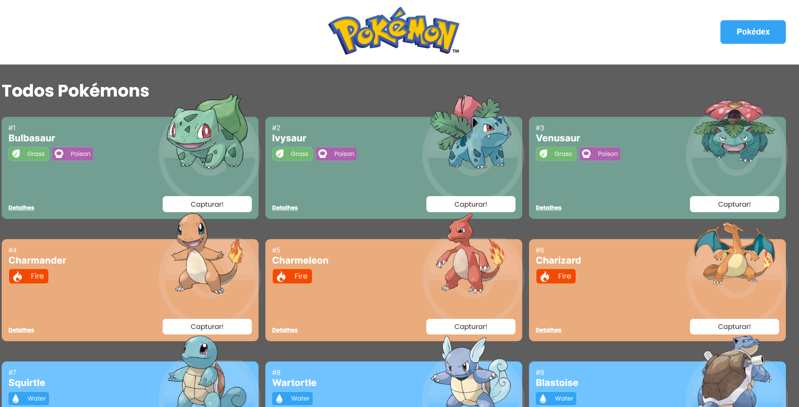

# Pokedex

## Table of contents

- [Overview](#overview)
  - [Features](#features)
  - [Preview](#preview)
  - [Demo](#demo)
- [Process](#process)
  - [Built with](#built-with)
- [Author](#author)

## :mega: Overview

Projeto do anime Pokemon.

### Features

- Capturar e remover pokemon da pokedex
- Pagina de detalhes sobre todos os pokemons
- Responsividade

### Preview

### Demo

[Clique aqui para visualizar o projeto](https://projetopokedex-rh.netlify.app)

## :newspaper: Process

- Consumo da Api [PokeApi](https://pokeapi.co)
- Persistencia de dados no local Storage.

### Built with

- [Javascript](https://developer.mozilla.org/pt-BR/docs/Web/JavaScript)
- [React.Js](https://reactjs.org)
- [CSS animations](https://animate.style)
- React Hooks

### :man: Author

<table>
  <tr>
    <td align="center">
          
         <a href="https://github.com/oitalodev"> <b>Ítalo Viana</b> </a> 
    </td>
  </tr>
</table>
